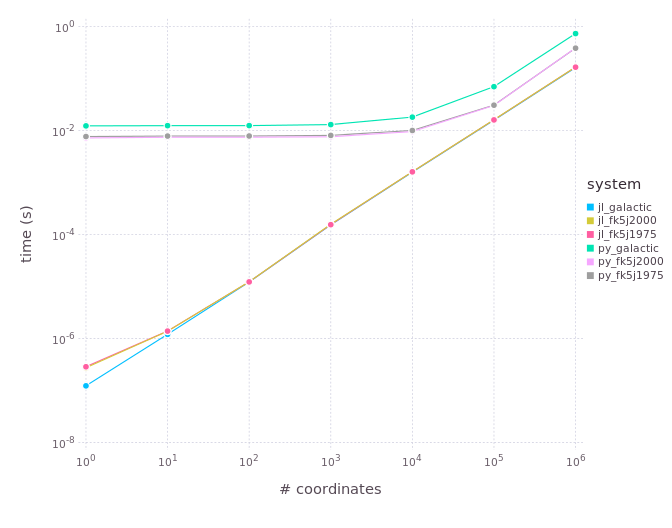

SkyCoords.jl
============

Basic astronomical coordinate systems in Julia

[](https://travis-ci.org/JuliaAstro/SkyCoords.jl)
[](https://ci.appveyor.com/project/kbarbary/skycoords-jl/branch/master)
[](https://coveralls.io/r/JuliaAstro/SkyCoords.jl?branch=master)

## Install

```julia
julia> Pkg.add("SkyCoords")
```

## Usage

There are currently three supported coordinate systems. The following
immutable types are used to represent coordinates in each system:

- `ICRSCoords`: ICRS coordinates system
- `GalCoords`: Galactic coordinates system
- `FK5Coords`: FK5 coordinates system (with arbitrary equninox)

Each type holds a longitude and latitude, and each is a subtype of
`AbstractSkyCoords`.

```julia
julia> using SkyCoords

# create a coordinates object
julia> c1 = ICRSCoords(0., 0.)  # inputs are ra, dec in radians
SkyCoords.ICRSCoords{Float64}(0.0,0.0)

# access ra, dec individually
julia> c1.ra
0.0

# convert to a different system
julia> c2 = convert(GalCoords, c1)
SkyCoords.GalCoords{Float64}(1.6814027872278692,-1.0504884034813007)

# Note that galactic coordinate fields are l, b
julia> c2.l
1.681404315278054

# FK5Coords is parameterized on equinox.
# Equinox refers to Julian year and can be floating-point or integer
# (though using integers seems to be slightly faster).
julia> convert(FK5Coords{2000}, c1)
SkyCoords.FK5Coords{2000,Float64}(1.1102233723050067e-7,4.411803426976326e-8)


# Arrays of coordinates
# =====================

# create an array of coordinates 
julia> c1 = [ICRSCoords(0., 0.) for i=1:3]
3-element Array{SkyCoords.ICRSCoords{Float64},1}:
 SkyCoords.ICRSCoords{Float64}(0.0,0.0)
 SkyCoords.ICRSCoords{Float64}(0.0,0.0)
 SkyCoords.ICRSCoords{Float64}(0.0,0.0)

# convert entire array to a different system
julia> convert(Vector{GalCoords{Float64}}, c1)
3-element Array{SkyCoords.GalCoords{Float64},1}:
 SkyCoords.GalCoords{Float64}(1.6814,-1.05049)
 SkyCoords.GalCoords{Float64}(1.6814,-1.05049)
 SkyCoords.GalCoords{Float64}(1.6814,-1.05049)

# There's no performance gain from using this "vectorized" convert,
# except conversions to/from FK5Coords, where the equinox precession
# can be done just once for the entire vector, leading to a modest ~2x
# speed up.
julia> convert(Vector{FK5Coords{1975, Float64}}, c1)
3-element Array{SkyCoords.FK5Coords{1975,Float64},1}:
 SkyCoords.FK5Coords{1975,Float64}(6.2776,-0.00242922)
 SkyCoords.FK5Coords{1975,Float64}(6.2776,-0.00242922)
 SkyCoords.FK5Coords{1975,Float64}(6.2776,-0.00242922)
```

### Angular Separation between Coordinates

The `separation` function allows you to compute the angular (great-circle)
distance between two coordinates, in radians, using
the [Vincenty formula](http://en.wikipedia.org/wiki/Great-circle_distance).  The
coordinates can be also given in different systems.  For example, according to
SIMBAD the `FK5Coords{2000}` coordinates
of [Mizar](http://simbad.u-strasbg.fr/simbad/sim-id?Ident=MIZAR) are

```julia
julia> mizar = FK5Coords{2000}(3.507787, 0.958628)
```

while the `GalCoords` coordinates of Alcor are

```julia
julia> alcor = GalCoords(1.968189, 1.072829)
```

Their angular separation is given by

```julia
julia> separation(mizar, alcor) # Radians
0.003435309169452688

julia> rad2deg(separation(mizar, alcor)) * 60 # Arcminutes
11.809723003933872
```

## Accuracy

All the supported conversions have been compared to the results of
astropy.coordinates (to better than 0.0001 arcsec agreement for Float64).
In turn, astropy.coordinates has been tested against many other tools.


## Performance

For small and moderate numbers of coordinates, conversions are much
faster than astropy.coordinates in Python. The follow plot shows the
performance for converting ICRS coordinates to various other systems
(Galactic, FK5J2000 and FK5J1975), using astropy.coordinates (`py_*`
labels) and SkyCoords.jl (`jl_*` labels). The x axis denotes the
number of coordinates being simultaneously converted, with 1
corresponding to scalar coordinates.



For scalar coordinates, SkyCoords.jl is up to 100,000 times
faster. For very large vectors of one million coordinates or more,
SkyCoords.jl is 2-4 times faster.  The source code for these
benchmarks can be found in `bench/`.


## License and Credits

License is MIT. This package profits from the hard work that went into
astropy.coordinates, *especially* in terms of testing and coordinate system
definitions.
